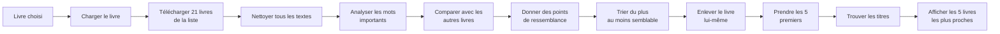

```mermaid
flowchart LR
    Start[Livre choisi] --> Charger[Charger le livre]
    
    Charger --> Telecharger[Télécharger 21 livres<br/>de la liste]
    
    Telecharger --> Nettoyer[Nettoyer tous les textes]
    
    Nettoyer --> Analyser[Analyser les mots<br/>importants]
    
    Analyser --> Comparer[Comparer avec les<br/>autres livres]
    
    Comparer --> Points[Donner des points<br/>de ressemblance]
    
    Points --> Trier[Trier du plus<br/>au moins semblable]
    
    Trier --> Enlever[Enlever le livre<br/>lui-même]
    
    Enlever --> Prendre[Prendre les 5<br/>premiers]
    
    Prendre --> Noms[Trouver les titres]
    
    Noms --> Afficher[Afficher les 5 livres<br/>les plus proches]
```
