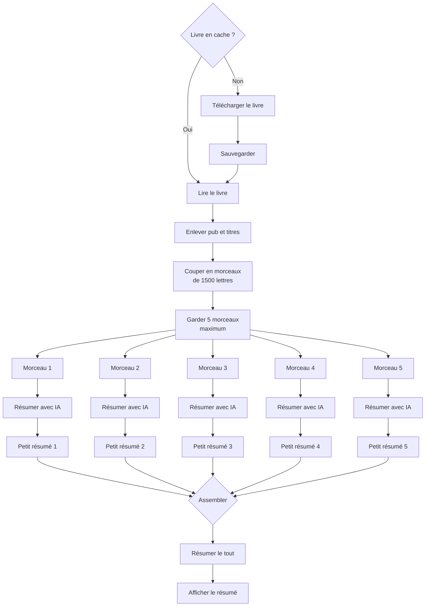

```mermaid
flowchart TD
    Start{Livre en cache ?} -->|Non| Télécharger[Télécharger le livre]
    Start -->|Oui| Lire[Lire le livre]
    
    Télécharger --> Sauvegarder[Sauvegarder]
    Sauvegarder --> Lire
    
    Lire --> Nettoyer[Enlever pub et titres]
    
    Nettoyer --> Couper[Couper en morceaux<br/>de 1500 lettres]
    
    Couper --> Garder[Garder 5 morceaux<br/>maximum]
    
    Garder --> Morceau1[Morceau 1]
    Garder --> Morceau2[Morceau 2]
    Garder --> Morceau3[Morceau 3]
    Garder --> Morceau4[Morceau 4]
    Garder --> Morceau5[Morceau 5]
    
    Morceau1 --> Resumer1[Résumer avec IA]
    Morceau2 --> Resumer2[Résumer avec IA]
    Morceau3 --> Resumer3[Résumer avec IA]
    Morceau4 --> Resumer4[Résumer avec IA]
    Morceau5 --> Resumer5[Résumer avec IA]
    
    Resumer1 --> Petit1[Petit résumé 1]
    Resumer2 --> Petit2[Petit résumé 2]
    Resumer3 --> Petit3[Petit résumé 3]
    Resumer4 --> Petit4[Petit résumé 4]
    Resumer5 --> Petit5[Petit résumé 5]
    
    Petit1 --> Assembler{Assembler}
    Petit2 --> Assembler
    Petit3 --> Assembler
    Petit4 --> Assembler
    Petit5 --> Assembler
    
    Assembler --> Final[Résumer le tout]
    
    Final --> Afficher[Afficher le résumé]

```
